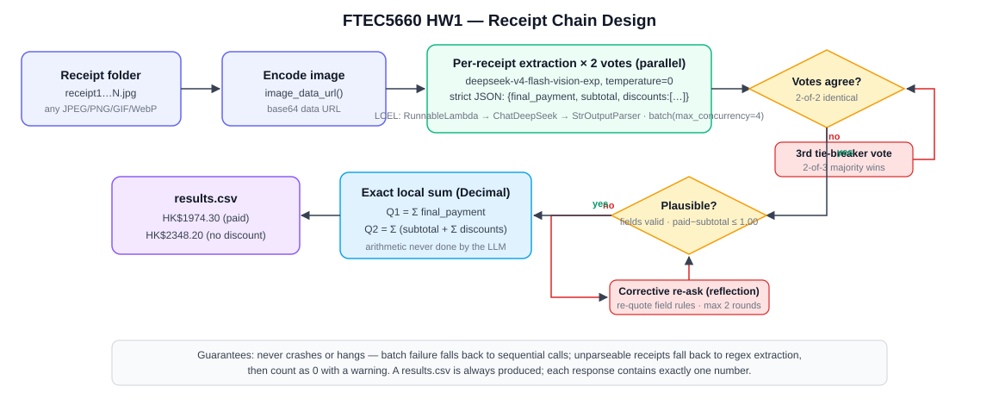
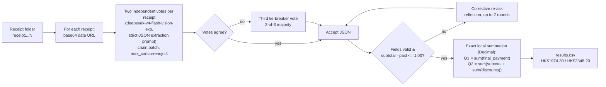

# FTEC5660 Homework 1: Receipt Chain

Build a LangChain pipeline that reads every supermarket receipt in a folder
with the vision-capable DeepSeek Flash model and answers these two questions:

1. How much money did I spend in total for these bills?
2. How much would I have had to pay without the discount?

For this homework, **amount spent** means the final payment after the receipt's
rounding line. **Without the discount** means the sum of the original positive
item prices: add back every promotion, coupon, member, app, packaging-damage,
and percentage discount, but do not add back rounding.

## Student task

Only edit the two functions in `hw1.py` that contain `### YOUR CODE HERE`:

- `build_chain()` creates your LangChain chain.
- `answer_queries()` runs the chain on the receipt images and returns one final
  response for each question.

You may use prompt chaining, routing, parallel calls, reflection, or a
combination. Your final responses should each contain one HKD amount. Do not
hard-code filenames or public answers; grading uses unseen receipt folders.

## Setup and public test

```bash
python3 -m venv .venv
source .venv/bin/activate
pip install -r requirements.txt
```

Put your DeepSeek key after `DEEPSEEK_API_KEY=` in `.env`, then run:

```bash
python3 hw1.py --image-folder public_test
```

The program creates `results.csv` in the current directory. Its columns are
`query`, `model_response`, and `correctness`. The public answers are in
`public_test/ground_truth.json`. The starter intentionally returns the dummy
response `please design your chain to answer these two queries.` so it runs
before you add any API code.

The required model is `deepseek-v4-flash-vision-exp`, the vision-capable
DeepSeek Flash model. JPEG, PNG, GIF, and WebP inputs are accepted by the
homework runner.


## Homework 1 solution: 

### Chain design





### Solution description

My chain separates *perception* from *arithmetic* so that the LLM only does what it is
good at. `build_chain()` wires a LangChain LCEL pipeline (`RunnableLambda -> ChatDeepSeek
-> StrOutputParser`) around `deepseek-v4-flash-vision-exp` with `temperature=0`. Each
receipt image is encoded with the provided `image_data_url()` helper and sent with a
strict-JSON extraction prompt that pins down the three amounts the two queries need:
`final_payment` (the payment line printed immediately after `ROUNDING`, e.g. OCTOPUS /
VISA / 扣除金額, ignoring duplicate payment summaries, change, and card-balance lines),
`subtotal` (the 小計/SUBTOTAL line before rounding), and `discounts` — a *line-by-line
list* of every negative amount printed **before** SUBTOTAL (Buy-X-Save promotions,
percentage discounts, coupons, app/member upgrades, packaging-damage rebates 包裝變形),
each as a positive number, explicitly excluding ROUNDING; the per-receipt discount total
is then summed locally. Two receipt-specific traps are handled explicitly in the prompt:
(1) **the right-hand amount column is authoritative** — a promotional label such as
`Buy 2 Save $5` can disagree with the amount actually deducted (`-$6.00`), and the
model must always take the amount column; (2) negative-looking lines *after* SUBTOTAL
(`餘額 -$15.90`, change, card balances) are never discounts. Because vision models
occasionally misread one digit even at `temperature=0`, `answer_queries()` takes **two
independent votes per receipt in one parallel `batch()`**; when the two votes disagree
(or a reply fails to parse) a third tie-breaker vote is taken and the 2-of-3 majority
wins, and any receipt that is still unusable goes through up to two corrective
"reflection" re-asks that quote the field definitions again. A plausibility gate
(`subtotal - final_payment <= HK$1.00`, all fields present and positive) plus a regex
fallback guarantee the run can never crash or hang — a grading run always produces a
`results.csv`. Finally, the amounts are summed **locally with `Decimal`** (never by the
LLM) — Q1 = Σ final_payment, Q2 = Σ (subtotal + Σ discounts) — and returned as
single-amount strings (`HK$1974.30`), so each response contains exactly one number as
the auto-grader requires. On the public test the chain answers both queries `correct`
consistently across repeated runs and random receipt subsets.

